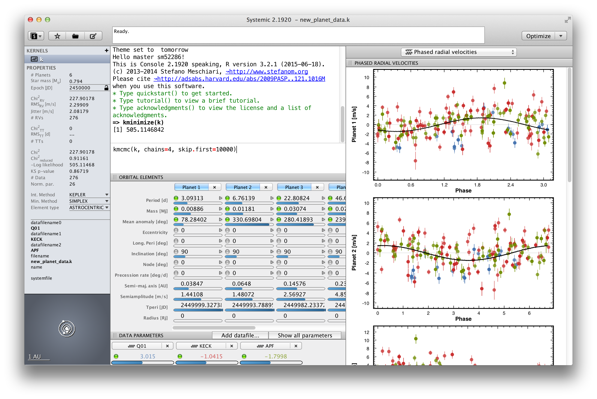

# Systemic 2 #
Systemic 2 is a C library for analyzing exoplanetary time series. The full distribution of Systemic also includes an R package to interface with the library, and a cross-platform GUI to perform interactive analysis.

## Installing ##
Please refer to the [Systemic 2 page](http://www.stefanom.org/?systemic) for instructions and binary downloads.

